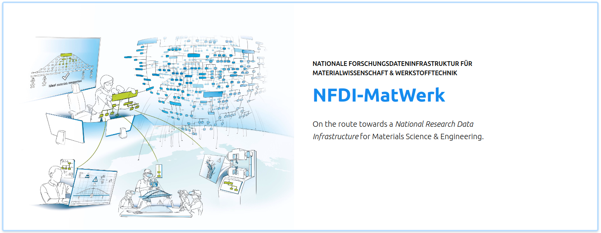

# Welcome to the Materials Science and Engineering Knowledge Graph (MSE KG)
Last update: 06.05.2025
Number of entities: 9608
Number of triples: 43534

## Introduction

The **MSE Knowledge Graph v2.0** is an updated version that is BFO-compliant, aligning with the Basic Formal Ontology to ensure semantic interoperability and ontological rigor. This updated version aims to represent consortium resources and enable integrative access to distributed, heterogeneous research data within the NFDI-MatWerk community and beyond.

## Navigation

- [SHMARQL endpoint](https://nfdi.fiz-karlsruhe.de/matwerk/shmarql/){:target="_blank"}
- [SPARQL endpoint](https://nfdi.fiz-karlsruhe.de/matwerk/sparql){:target="_blank"}
- [Sparklis](http://www.irisa.fr/LIS/ferre/sparklis/osparklis.html?title=Core%20English%20DBpedia&endpoint=https%3A//nfdi.fiz-karlsruhe.de/matwerk/sparql){:target="_blank"}
- [The MatWerk ontology (MWO)](https://ise-fizkarlsruhe.github.io/mwo/){:target="_blank"}
- [The NFDI Core Ontology (NFDIcore)](https://ise-fizkarlsruhe.github.io/nfdicore/){:target="_blank"}
- [Data collection spreadsheets](https://drive.google.com/file/d/1GS5vKDWDPXeNWJX6UMZk78gq0gaVQ2RW/view){:target="_blank"}
- [NFDI-MatWerk LOD Working Group](https://iuc12-nfdi-matwerk-ta-oms-7fd4826d9051b0dd93b21aa77d06d1d8c71c4.pages.rwth-aachen.de/){:target="_blank"}
- [About NFDI-MatWerk consortium](https://nfdi-matwerk.de/){:target="_blank"}
- [Contact Us](mailto:MatWerkOMS@fz-juelich.de)

## Purpose

The **MSE Knowledge Graph (MSE-KG)**:

- Provides a centralized backend data resource for the NFDI MatWerk portal.
- Integrates research data from various institutions.
- Supports interdisciplinary collaboration across consortiums.
- Continuously evolves with updates from the community.

## Content

The MSE Knowledge Graph encompasses diverse categories:

- **Community Structure**: Researchers, projects, universities, institutions.
- **Infrastructure**: Software, workflows, vocabularies, facilities.
- **Data**: Repositories, publications, datasets, reference data.
- **Educational Resources**: Lectures, workshops, lecture notes.

## How to Contribute

To contribute to the MSE-KG:

1. [Download data collection spreadsheets](https://drive.google.com/file/d/1GS5vKDWDPXeNWJX6UMZk78gq0gaVQ2RW/view){:target="_blank"}.
2. Add your data.
3. Send the completed spreadsheet to [MatWerkOMS@fz-juelich.de](mailto:MatWerkOMS@fz-juelich.de).

---

_For more information, visit the [NFDI-MatWerk official website](https://nfdi-matwerk.de/){:target="_blank"}._

