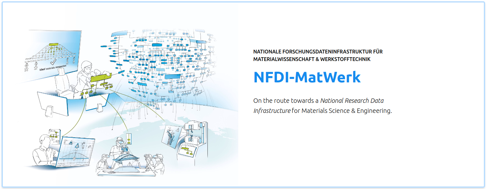

MSE-KG · v2.1

# The Materials Science and Engineering (MSE) Knowledge Graph

**Semantic integration of distributed materials science resources** — enabling structured discovery, cross-resource linkage, and machine-actionable reuse across datasets, publications, software, and domain actors.

Aligned with **BFO** and domain ontologies for full semantic interoperability.

🕐 Updated 31.03.2026
~289K Triples
Open Access

## Explore the Knowledge Graph

📊

**Dashboard**

Visualizations, statistics, and interactive views of the graph's content, structure, and evolution over time.

<a href="https://superset.ise.fiz-karlsruhe.de/superset/dashboard/mse-kg-dashboard/" target="_blank" class="card-btn">Open Dashboard </a>

🔍

**SPARQL Endpoint**

Perform queries, integrate data into workflows, and run federated queries across multiple sources.

<a href="https://nfdi.fiz-karlsruhe.de/matwerk/sparql?query=SELECT%20*%20WHERE%20%7B%20?s%20?p%20?o%20%7D%20LIMIT%201" target="_blank" class="card-btn">Query Endpoint </a>

🧭

**SHMARQL Search**

Guided semantic search and browse interface for users who want to explore the graph without writing queries.

<a href="https://nfdi.fiz-karlsruhe.de/matwerk/shmarql/" target="_blank" class="card-btn">Search Graph </a>

✨

**Sparklis Explorer**

Natural language-style faceted exploration — no SPARQL knowledge required.

<a href="https://www.irisa.fr/LIS/ferre/sparklis/osparklis.html?endpoint=https%3A//nfdi.fiz-karlsruhe.de/matwerk/sparql&proxy_url=https%3A//nfdi.fiz-karlsruhe.de/matwerk/sparql&method_get=true" target="_blank" class="card-btn">Explore </a>

## Graph Content at a Glance

👥

**Community**  
Researchers, projects, universities, institutions

⚙️

**Infrastructure**  
Software, workflows, vocabularies, facilities

🗃️

**Data Resources**  
Repositories, publications, datasets, reference data

🎓

**Education**  
Lectures, workshops, lecture notes

## Ontological Foundation

The MSE KG is grounded in explicit ontological modeling using formal vocabularies that ensure logical interpretability across heterogeneous sources.

**NFDIcore**

The NFDI Core Ontology — provides the shared vocabulary for all NFDI consortia resources.

<a href="https://ise-fizkarlsruhe.github.io/nfdicore/" target="_blank">View Ontology </a>

**MWO**

The MatWerk Ontology — domain-specific extensions for materials science and engineering.

<a href="https://ise-fizkarlsruhe.github.io/mwo/" target="_blank">View Ontology </a>

## Contribute Your Data

!!! tip "Grow the graph"
    The MSE KG improves with community contributions. Adding your data increases visibility and enables new connections across the materials science ecosystem.

<a href="https://nfdi.fiz-karlsruhe.de/matwerk/upload/" class="md-button md-button--primary">How to Contribute?</a>

📄 **Spreadsheet / Tabular**  
Upload to Zenodo → auto-harvested

🔗 **RDF / Ontology-aligned**  
Direct integration as named graph

🌐 **SPARQL Endpoint**  
Register for federated access

🏷️ **FAIR Digital Objects**  
Semi-automated FDO harvesting

## Community & Coordination

**🤝 LOD Working Group**  
Modeling decisions, onboarding, and integration strategies across institutions.  
<a href="https://iuc12-nfdi-matwerk-ta-oms-7fd4826d9051b0dd93b21aa77d06d1d8c71c4.pages.rwth-aachen.de/" target="_blank">Join the Group </a>

**🐛 GitHub Issues**  
Report problems, propose mappings, or request new data types.  

<a href="https://github.com/ISE-FIZKarlsruhe/matwerk/issues" target="_blank">Open an Issue </a>

**🌍 NFDI-MatWerk**  
Broader consortium context and programme information.  

<a href="https://nfdi-matwerk.de/" target="_blank">Visit Website </a>

