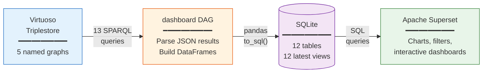

# Dashboard

**DAG ID:** `dashboard`
**Schedule:** Daily at 00:00 UTC (`0 0 * * *`)
**File:** `dags/dashboard.py`

## What It Does

Computes Knowledge Graph statistics by executing SPARQL queries against the Virtuoso triplestore and stores the results in a SQLite database. This database powers the [Apache Superset](https://superset.apache.org/) analytics dashboard, which provides interactive visualisations of MSE-KG content without requiring SPARQL expertise.

The DAG performs a daily snapshot of the graph's state, enabling time-series tracking of growth, content distribution, and structural evolution.

!!! info "Automatic scheduling"
    This DAG runs automatically every day at midnight UTC. No manual triggering is required.

## Architecture



## Task Chain


## SPARQL Queries

The DAG executes 13 distinct SPARQL query patterns against Virtuoso, each targeting the 5 MSE-KG named graphs. Queries use HTTP Digest authentication and return JSON results.

### Graph Discovery

```sparql
SELECT DISTINCT ?g
WHERE {
  GRAPH ?g { ?s ?p ?o }
  FILTER(STRSTARTS(STR(?g), "https://nfdi.fiz-karlsruhe.de/matwerk"))
}
```

### Per-Graph Metrics

| Query | Purpose | Key Pattern |
|-------|---------|-------------|
| **Triple & Subject Counts** | Graph size | `COUNT(*) AS ?triples, COUNT(DISTINCT ?s) AS ?subjects` |
| **Class Counts** | Instance distribution per class | `?s a ?class` grouped, top 200 |
| **Property Usage** | Predicate frequency | `?s ?p ?o` grouped by `?p`, top 100 |
| **Sankey Edges** | Class → Property relationships | Joins `?s a ?sourceClass` with `?s ?p ?o`, top 300 |
| **Entity Type Counts** | Concept distribution | `?entity a ?Concept`, top 500 |
| **Top 10 Concepts** | Ranked concepts | Same + `ROW_NUMBER()` window function |
| **Dataset Types** | Counts by dataset class | `VALUES ?class { NFDI_0000009 ... }` |
| **Dataset Details** | Title, creator, affiliation, link | Property path traversal via `IAO_0000235`, `BFO_0000178` |
| **Content Counts** | High-level summary | Distinct datasets, publications, events |
| **Organizations by City** | Geographic distribution | `?org BFO_0000171 ?city` |
| **Top Orgs by People** | Affiliation ranking | `?person RO_0000057 ?process`, top 50 |

### Dataset Detail Query (Example)

```sparql
SELECT DISTINCT ?dataset
  (SAMPLE(?title) AS ?title)
  (SAMPLE(?creator) AS ?creator)
  (SAMPLE(?aff) AS ?creator_affiliation)
  (SAMPLE(?link) AS ?link)
WHERE {
  GRAPH <{graph}> {
    ?dataset a <https://nfdi.fiz-karlsruhe.de/ontology/NFDI_0000009> .
    OPTIONAL {
      ?dataset <http://purl.obolibrary.org/obo/IAO_0000235> ?titleNode .
      ?titleNode <https://nfdi.fiz-karlsruhe.de/ontology/NFDI_0001008> ?title .
    }
    OPTIONAL {
      ?dataset <http://purl.obolibrary.org/obo/BFO_0000178> ?creatorNode .
      ?creatorNode rdfs:label ?creator .
    }
  }
}
GROUP BY ?dataset
LIMIT 500
```

## SQLite Storage

Results are stored in 12 timestamped tables with corresponding `*_latest` views:

| Table | Content | Key Columns |
|-------|---------|-------------|
| `kg_graph_stats` | Triple/subject counts per graph | `ts_utc`, `graph`, `triples`, `subjects` |
| `kg_graph_class_counts` | Class usage per graph | `class_iri`, `class_label`, `instances` |
| `kg_graph_property_counts` | Property usage per graph | `property_iri`, `usage_count` |
| `kg_sankey_class_property` | Class→Property edges (for Sankey diagrams) | `source_iri`, `target_iri`, `value` |
| `kg_entity_type_counts` | Entity type instance counts | `concept_iri`, `concept_label`, `count` |
| `kg_dataset_type_counts` | Dataset type counts | `dataset_type_iri`, `count` |
| `kg_content_counts` | Summary (datasets, publications, events) | `datasets`, `publications`, `events` |
| `kg_datasets` | Dataset list with metadata | `dataset_iri`, `title`, `creator`, `link` |
| `kg_org_city_counts` | Organizations by city | `city_label`, `org_count` |
| `kg_top_org_by_people` | Top organizations by affiliation | `org_label`, `people_count` |
| `kg_top_concepts` | Top 10 concepts per graph | `concept_label`, `count`, `rank` |

### Latest Views

Each table has a `*_latest` view that exposes only the most recent snapshot:

```sql
CREATE VIEW kg_graph_stats_latest AS
SELECT * FROM (
  SELECT *, ROW_NUMBER() OVER (
    PARTITION BY graph ORDER BY ts_utc DESC
  ) AS rn
  FROM kg_graph_stats
  WHERE graph LIKE 'https://nfdi.fiz-karlsruhe.de/matwerk%'
) WHERE rn = 1;
```

This enables Superset charts to always display current data while preserving historical snapshots for trend analysis.

## Input

| Source | Description |
|--------|-------------|
| `matwerk-virtuoso_sparql` | Virtuoso SPARQL endpoint (read-write) |
| `matwerk-virtuoso_user` / `matwerk-virtuoso_pass` | HTTP Digest credentials |
| `matwerk_dashboard_db` | SQLite connection string |

## Output

- 12 SQLite tables with timestamped rows
- 12 `*_latest` views for current-state dashboards
- Consumed by [Apache Superset](https://superset.apache.org/) at [`superset.ise.fiz-karlsruhe.de`](https://superset.ise.fiz-karlsruhe.de/superset/dashboard/mse-kg-dashboard/)

## Downstream

None. Runs automatically every day.
