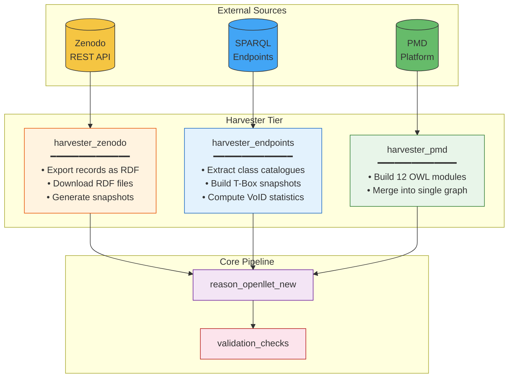
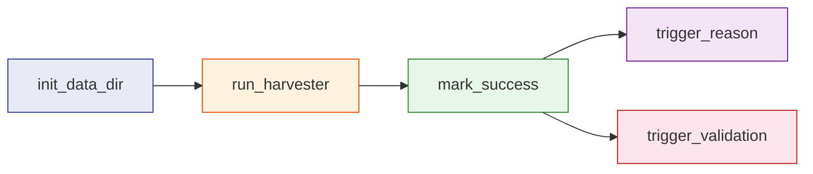
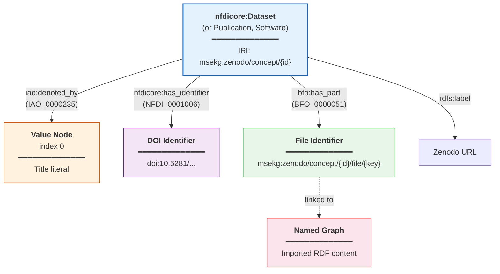
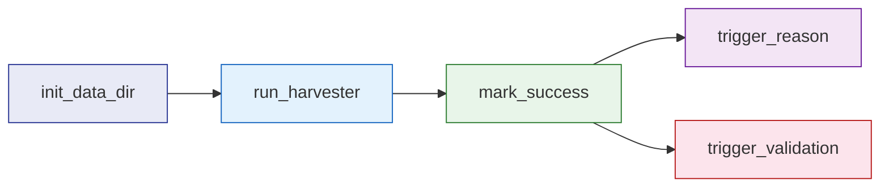
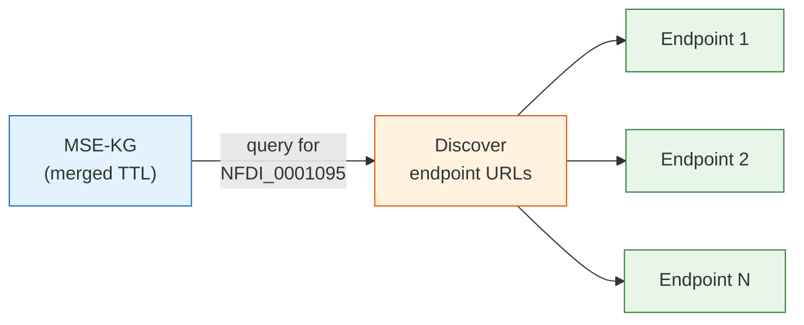
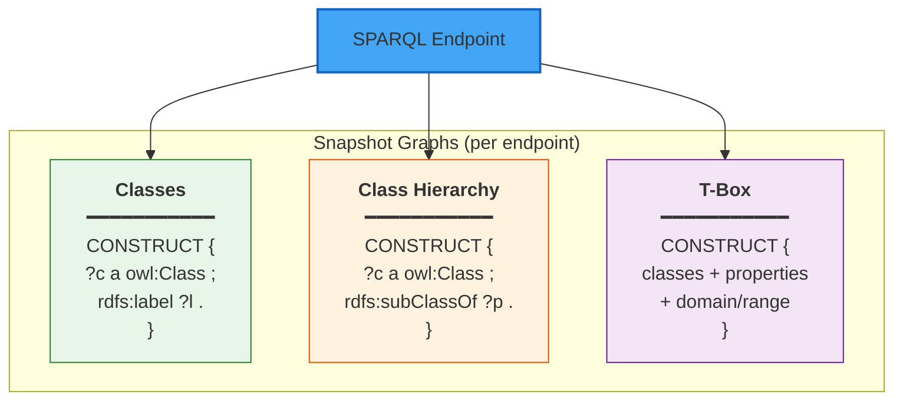
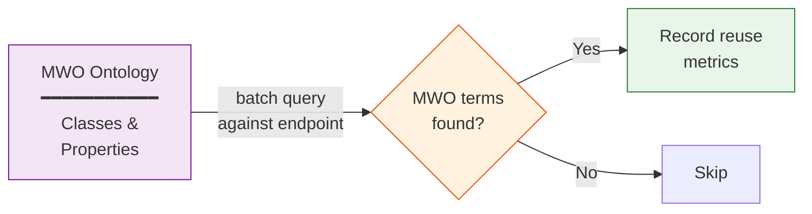
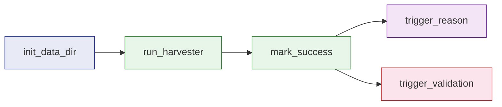
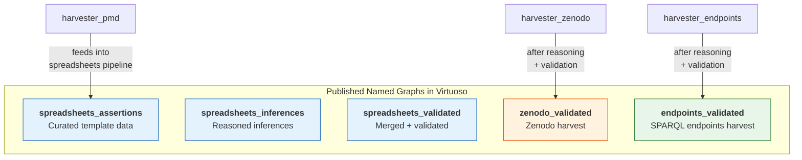

# Harvesters

Three harvester DAGs collect data from external sources, transform it into ontology-aligned RDF, and automatically trigger reasoning and validation. Each harvester produces deterministic, provenance-aware named graphs that are integrated into the MSE-KG.

!!! info "Scheduling"
    All three harvesters run on a `@weekly` schedule and automatically trigger `reason_openllet_new` followed by `validation_checks` on completion.

## Architecture Overview



---

## harvester_zenodo

**DAG ID:** `harvester_zenodo` · **Schedule:** `@weekly` · **File:** `dags/harvester_zenodo.py`

### What It Does

The Zenodo harvester converts records from the [NFDI-MatWerk Zenodo community](https://zenodo.org/communities/nfdi-matwerk/) into ontology-aligned RDF. It operates in two phases: first exporting community records as RDF triples, then harvesting individual datasets referenced in the MSE-KG that point to Zenodo DOIs.

### Task Chain



The `run_harvester` task performs two operations:

1. **`export_zenodo.run()`** — Fetches all records from the Zenodo community via REST API and converts them to RDF
2. **`fetch_zenodo.run()`** — Queries the merged MSE-KG for datasets with Zenodo URLs, then harvests each individually

### RDF Modelling

Each Zenodo record is converted to a network of ontology-aligned individuals:



#### Type Mapping

Zenodo `resource_type` values are mapped to MWO/NFDIcore classes:

| Zenodo Type | OWL Class | IRI |
|------------|-----------|-----|
| `dataset`, `image` | `nfdicore:Dataset` | `NFDI_0000009` |
| `publication`, `article`, `book`, `thesis`, `report`, `preprint` | `nfdicore:Publication` | `NFDI_0000190` |
| `software` | `nfdicore:Software` | `NFDI_0000198` |
| `lesson`, `presentation` | `nfdicore:Lecture` | `NFDI_0010022` |
| `image` (also typed as) | `iao:Figure` | `IAO_0000308` |

#### Deterministic IRI Minting

All IRIs are deterministic, ensuring idempotent re-runs:

```
Instance:       msekg:zenodo/concept/{conceptrecid}
Value node:     msekg:zenodo/concept/{conceptrecid}/node/{index}
File ID:        msekg:zenodo/concept/{conceptrecid}/file/{file_key}
File graph:     msekg:zenodo/concept/{conceptrecid}/graph/{file_key}
```

!!! tip "Base IRI"
    `msekg:` expands to `https://nfdi.fiz-karlsruhe.de/matwerk/msekg/`

#### File Handling

When a Zenodo record contains RDF files (`.ttl`, `.owl`, `.rdf`, `.jsonld`, `.nq`, `.trig`) or ZIP archives containing RDF:

1. Files are downloaded (max 500 MB per file)
2. RDF is parsed and imported into named graphs with deterministic IRIs
3. ZIP archives are extracted with zip-slip protection
4. For each imported graph, three snapshot views are generated:

| Snapshot | SPARQL Pattern | Purpose |
|----------|---------------|---------|
| **Classes** | `?c a owl:Class` | All declared classes with labels |
| **Class Hierarchy** | `?c rdfs:subClassOf ?parent` | Subsumption structure |
| **T-Box** | Classes + properties + domain/range | Schema-level axioms only |

#### Dataset URL Discovery

The harvester also queries the merged MSE-KG to find datasets referencing Zenodo:

```sparql
SELECT DISTINCT ?dataset ?url WHERE {
  VALUES ?class {
    <https://nfdi.fiz-karlsruhe.de/ontology/NFDI_0000009>
    <https://nfdi.fiz-karlsruhe.de/ontology/MWO_0001058>
    <https://nfdi.fiz-karlsruhe.de/ontology/MWO_0001056>
    <https://nfdi.fiz-karlsruhe.de/ontology/MWO_0001057>
  }
  ?dataset a ?class .
  ?dataset <http://purl.obolibrary.org/obo/IAO_0000235> ?urlNode .
  ?urlNode <https://nfdi.fiz-karlsruhe.de/ontology/NFDI_0001008> ?u .
  BIND(STR(?u) AS ?url)
  FILTER(isIRI(?dataset) && CONTAINS(LCASE(?url), "zenodo"))
}
```

### Input / Output

=== "Input"

    | Source | Description |
    |--------|-------------|
    | `matwerk_sharedfs` | Shared filesystem path |
    | `matwerk_last_successful_merge_run` | Path to merged asserted TTL |
    | Zenodo REST API | `https://zenodo.org/api/records` |

=== "Output"

    | File | Description |
    |------|-------------|
    | `zenodo.ttl` | Default graph — all record metadata as RDF |
    | `datasets_urls.csv` | Discovered (dataset, URL) pairs |
    | `harvested/` | Downloaded and processed RDF files |
    | `*.nq` | Named graph snapshots (N-Quads) |

### Triggers Downstream

- `reason_openllet_new` → artifact=`zenodo`, in_ttl=`zenodo.ttl`
- `validation_checks` → artifact=`zenodo`, inferences_ttl=`zenodo_inferences.ttl`

---

## harvester_endpoints

**DAG ID:** `harvester_endpoints` · **Schedule:** `@weekly` · **File:** `dags/harvester_endpoints.py`

### What It Does

The SPARQL endpoint harvester discovers endpoints registered in the MSE-KG, extracts their schema-level structure, computes VoID statistics, and measures ontology reuse against MWO. This enables the MSE-KG to serve as a federated catalogue of distributed MSE data sources.

### Task Chain



### Endpoint Discovery

Endpoints are discovered from the merged MSE-KG by querying for instances of `NFDI_0001095` (SPARQL Endpoint):



Each endpoint URL is extracted via the path:

```
?endpoint a NFDI_0001095 .
?endpoint IAO_0000235 ?node .
?node NFDI_0001008 ?url .
```

### Schema Extraction

For each discovered endpoint, three CONSTRUCT queries extract schema-level information:



Each snapshot is stored in a deterministic named graph:

```
IRI: {BASE}snapshot/sparql/{func_key}/{sha256_hash[:24]}
```

Where `func_key` ∈ {`classes`, `classHierarchy`, `tbox`} and the hash is computed from `{func_key}|{normalized_url}`.

### VoID Statistics

For each endpoint, the harvester computes comprehensive statistics:

| Metric | Method |
|--------|--------|
| **Class count** | `SELECT (COUNT(DISTINCT ?c) ...)` |
| **Object property count** | `SELECT (COUNT(DISTINCT ?p) ...)` |
| **Data property count** | `SELECT (COUNT(DISTINCT ?p) ...)` |
| **Instance count** | `SELECT (COUNT(DISTINCT ?s) ...)` |
| **Class partitions** | Per-class instance counts via `void:classPartition` |
| **Vocabularies** | All namespaces observed via `void:vocabulary` |

### MWO Reuse Analysis

A distinguishing feature of the endpoint harvester is its ontology reuse measurement. For each endpoint, the harvester checks which MWO classes and properties appear as types or predicates:



The queries check for MWO terms in batches:

```sparql
SELECT DISTINCT ?c WHERE {
  VALUES ?c { <mwo_class_1> <mwo_class_2> ... }
  { ?c a owl:Class . } UNION { ?x a ?c . }
}
```

!!! info "Why Reuse Analysis Matters"
    By quantifying how much each external endpoint aligns with MWO, the MSE-KG can identify which endpoints are most suitable for federated queries, guide ontology mapping efforts, and track adoption of shared vocabularies across the NFDI-MatWerk ecosystem.

### Statistics Annotation

All statistics are stored as structured `rdfs:comment` annotations on the endpoint individual:

```
SPARQL endpoint: https://example.org/sparql
Counts:
- classes: 42
- objectProperties: 18
- dataProperties: 7
- instances: 1,234

Vocabularies (namespaces observed):
- total: 5

Reused from MWO (heuristic):
- classes: 12 (cmso:AtomicScaleSample, ...)
- objectProperties: 3
- dataProperties: 2
```

### Input / Output

=== "Input"

    | Source | Description |
    |--------|-------------|
    | `matwerk_sharedfs` | Shared filesystem path |
    | `matwerk_last_successful_merge_run` | Path to merged asserted TTL |
    | `matwerk_ontology` | MWO ontology URL (for reuse analysis) |
    | External SPARQL endpoints | Discovered from asserted TTL |

=== "Output"

    | File | Description |
    |------|-------------|
    | `dataset_stats.ttl` | Unified statistics graph |
    | `named_graphs/*.nq` | Per-endpoint snapshot named graphs (N-Quads) |
    | `named_graphs/*.ttl` | Per-endpoint snapshots (Turtle) |
    | `sparql_sources.json` | State: endpoint → graph IRI mapping |
    | `sparql_sources_list.json` | Summary with counts and metadata |

### Triggers Downstream

- `reason_openllet_new` → artifact=`endpoints`, in_ttl=`dataset_stats.ttl`
- `validation_checks` → artifact=`endpoints`, inferences_ttl=`endpoints_inferences.ttl`

---

## harvester_pmd

**DAG ID:** `harvester_pmd` · **Schedule:** `@weekly` · **File:** `dags/harvester_pmd.py`

### What It Does

Harvests data from the Materials Platform for Data (PMD). Builds ROBOT templates from harvested CSV, generates 12 OWL modules, and merges them into a single asserted graph.

### Task Chain



### Input / Output

=== "Input"

    | Source | Description |
    |--------|-------------|
    | `matwerk_sharedfs` | Shared filesystem |
    | `matwerk_ontology` | Base ontology URL |
    | `robotcmd` | ROBOT command |
    | PMD API | External data source |

=== "Output"

    | File | Description |
    |------|-------------|
    | `pmd_asserted.ttl` | Merged asserted output |
    | `modules/` | 12 individual OWL modules |

### Triggers Downstream

- `reason_openllet_new` → artifact=`pmd`, in_ttl=`pmd_asserted.ttl`
- `validation_checks` → artifact=`pmd`, inferences_ttl=`pmd_inferences.ttl`

---

## Named Graph Strategy

All harvesters follow a consistent named graph strategy that ensures provenance tracking and selective access:



!!! warning "Quality Assurance"
    All harvested content passes through the same reasoning and SHACL validation pipeline as manually curated template data. This ensures that externally sourced RDF is held to the same quality standard as curated content — no data enters the published graph without validation.
