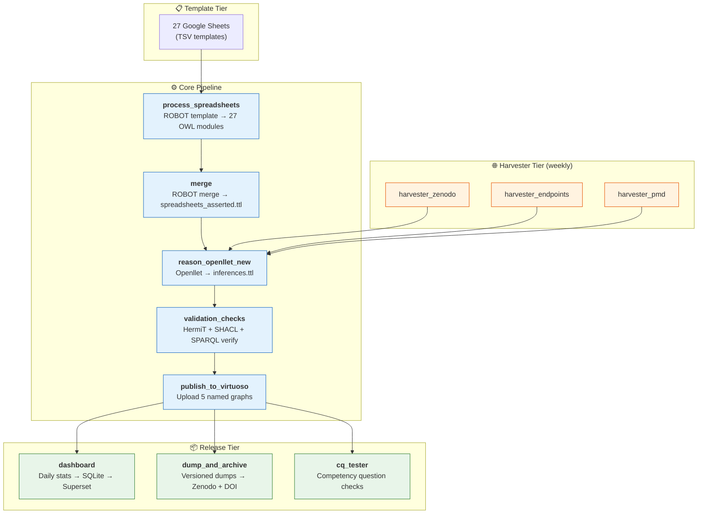
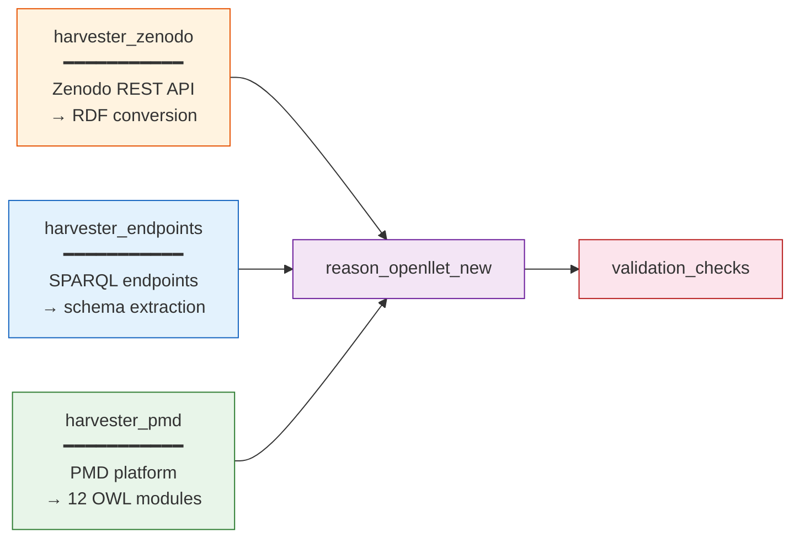

# Pipeline Overview

The MSE-KG is constructed, validated, and published through an automated pipeline orchestrated by [Apache Airflow](https://airflow.apache.org/). The pipeline comprises eleven Directed Acyclic Graphs (DAGs) organised into three architectural tiers: a core processing chain, a parallel harvester tier, and a release tier.

Ontology transformations throughout the pipeline rely on [ROBOT](https://robot.obolibrary.org/), an open-source command-line tool for automating OWL ontology development tasks including template processing, merging, reasoning, module extraction, and quality reporting.

## Pipeline Architecture

## Core Pipeline

The core pipeline is a linear chain that transforms curated spreadsheet data into a published, validated knowledge graph:

| Step | DAG | Tool | Output |
|------|-----|------|--------|
| 1 | `process_spreadsheets` | [ROBOT](https://robot.obolibrary.org/) template + merge | 27 individual OWL modules |
| 2 | `merge` | ROBOT merge + HermiT consistency check | `spreadsheets_asserted.ttl` |
| 3 | `reason_openllet_new` | [Openllet](https://github.com/Galigator/openllet) extract | `spreadsheets_inferences.ttl` |
| 4 | `validation_checks` | HermiT + SHACL + SPARQL verify | Validated, merged graph |
| 5 | `publish_to_virtuoso` | Virtuoso CRUD API | 5 named graphs live |

!!! tip "ROBOT"
    [ROBOT](https://robot.obolibrary.org/) (ROBOT is an OBO Tool) is used throughout the pipeline for template processing, ontology merging, reasoning pre-filtering, format conversion, and quality checks. It provides a consistent, scriptable interface to OWL operations that integrates naturally with Airflow task orchestration.

## Harvester Tier

Three independent harvesters run weekly and feed into the core pipeline at the reasoning stage:

!!! info "Harvester triggering"
    All harvesters automatically trigger `reason_openllet_new` followed by `validation_checks` on completion. After all succeed, trigger `publish_to_virtuoso` manually.

## Release Tier

| DAG | Schedule | Purpose |
|-----|----------|---------|
| `dashboard` | Daily | Aggregates SPARQL statistics into SQLite for [Apache Superset](https://superset.apache.org/) |
| `dump_and_archive` | Manual | Creates versioned RDF dumps, uploads to Zenodo with DOI |
| `cq_tester` | Manual | Validates competency questions against the live endpoint |

## Named Graphs Published

The pipeline publishes five named graphs to the Virtuoso triplestore:

| Named Graph | Source | Content |
|-------------|--------|---------|
| `matwerk/spreadsheets_assertions` | Core pipeline | Merged OWL modules from 27 templates |
| `matwerk/spreadsheets_inferences` | Core pipeline | Openllet-derived inferences |
| `matwerk/spreadsheets_validated` | Core pipeline | Merged assertions + inferences, validated |
| `matwerk/zenodo_validated` | Zenodo harvester | Zenodo community records as RDF |
| `matwerk/endpoints_validated` | Endpoint harvester | SPARQL endpoint metadata and statistics |

All graph IRIs are prefixed with `https://nfdi.fiz-karlsruhe.de/matwerk/`.
