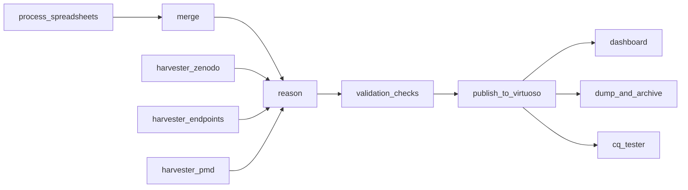

# Pipeline Overview

## Full pipeline flow



```
Google Sheets (27 TSV templates)
  |
  v
process_spreadsheets          (build 27 OWL modules)
  |
  v
merge                         (merge all OWL -> spreadsheets_asserted.ttl)
  |
  +---> reason_openllet_new   (OWL reasoning -> spreadsheets_inferences.ttl)
  |       |
  |       v
  +---> validation_checks     (merge + validate with SHACL/SPARQL/HermIT)
          |
          v
        publish_to_virtuoso   (upload 5 named graphs to Virtuoso)
          |
          +---> dashboard      (daily: compute stats -> SQLite -> Superset)
          +---> cq_tester      (test competency questions)
          +---> dump_and_archive (manual: create versioned dumps -> Zenodo)
```

## Harvester pipelines (run weekly, in parallel)

```
harvester_pmd        ---> reason_openllet_new ---> validation_checks
harvester_zenodo     ---> reason_openllet_new ---> validation_checks
harvester_endpoints  ---> reason_openllet_new ---> validation_checks
```

!!! info "Harvester triggering"
    Harvesters automatically trigger reasoning and validation. After all succeed, trigger `publish_to_virtuoso` manually.

## Named graphs published

| Named Graph | Source |
|-------------|--------|
| `https://nfdi.fiz-karlsruhe.de/matwerk/spreadsheets_assertions` | Merged OWL modules |
| `https://nfdi.fiz-karlsruhe.de/matwerk/spreadsheets_inferences` | Reasoned inferences |
| `https://nfdi.fiz-karlsruhe.de/matwerk/spreadsheets_validated` | Merged + validated |
| `https://nfdi.fiz-karlsruhe.de/matwerk/zenodo_validated` | Zenodo harvest |
| `https://nfdi.fiz-karlsruhe.de/matwerk/endpoints_validated` | SPARQL endpoints harvest |

## Airflow Variables reference

### Core

| Variable | Used by | Description |
|----------|---------|-------------|
| `matwerk_sharedfs` | All DAGs | Base path for run outputs |
| `matwerk_ontology` | spreadsheets, harvesters, validation | Base ontology URL |
| `robotcmd` | spreadsheets, merge, harvesters, validation | ROBOT tool path |
| `sunletcmd` | reason | Sunlet reasoner path |
| `openlletnewcmd` | reason_openllet_new | OpenLlet reasoner path |

### Virtuoso

| Variable | Used by | Description |
|----------|---------|-------------|
| `matwerk-virtuoso_crud` | publish_to_virtuoso | CRUD endpoint URL |
| `matwerk-virtuoso_sparql` | publish_to_virtuoso, dashboard | SPARQL endpoint (read-write) |
| `matwerk-virtuoso_sparql_ro` | cq_tester | SPARQL endpoint (read-only) |
| `matwerk-virtuoso_user` | publish_to_virtuoso, dashboard | Username |
| `matwerk-virtuoso_pass` | publish_to_virtuoso, dashboard | Password |

### Dashboard

| Variable | Used by | Description |
|----------|---------|-------------|
| `matwerk_dashboard_db` | dashboard | SQLite connection string |

### Zenodo & GitHub (dump_and_archive)

| Variable | Used by | Description |
|----------|---------|-------------|
| `matwerk_zenodo_token` | dump_and_archive | Zenodo API token |
| `matwerk_zenodo_base_url` | dump_and_archive | Optional, defaults to `https://zenodo.org/api` |
| `matwerk_zenodo_concept_id` | dump_and_archive | Auto-managed, links Zenodo versions |
| `matwerk_github_token` | dump_and_archive | GitHub PAT for pushing manifest |
| `matwerk_github_repo` | dump_and_archive | Optional, defaults to `ISE-FIZKarlsruhe/matwerk` |

### Success-tracking (auto-managed)

!!! warning "Do not set these manually"
    These variables are automatically managed by each DAG on successful completion. Editing them by hand can cause downstream DAGs to read stale data.

| Variable | Set by | Used by |
|----------|--------|---------|
| `matwerk_last_successful_spreadsheet_run` | process_spreadsheets | merge |
| `matwerk_last_successful_merge_run` | merge | reason, validation, harvesters, publish, dump |
| `matwerk_last_successful_reason_run` | reason | validation, publish, dump |
| `matwerk_last_successful_validated_run` | validation_checks | publish, dump |
| `matwerk_last_successful_harvester_pmd_run` | harvester_pmd | publish, dump |
| `matwerk_last_successful_harvester_zenodo_run` | harvester_zenodo | publish, dump |
| `matwerk_last_successful_harvester_endpoints_run` | harvester_endpoints | publish, dump |
