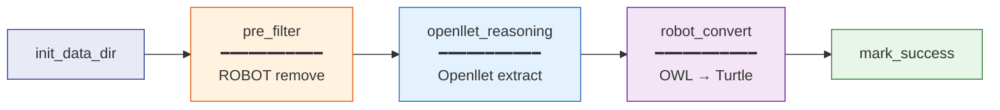

# Reasoning

**DAG IDs:** `reason` (Sunlet), `reason_openllet_new` ([Openllet](https://github.com/Galigator/openllet))
**Schedule:** Manual trigger only
**Files:** `dags/reason-spreadsheets.py`, `dags/reason_openlletnew.py`

## What It Does

Performs OWL 2 DL reasoning over the MSE-KG to materialise implicit knowledge that is only derivable from the ontological axioms defined in MWO, NFDIcore, and BFO. The reasoner computes the deductive closure of the ABox with respect to the TBox, generating inferred class assertions, subclass relationships, property assertions, and inverse property entailments that are not explicitly stated in the input graph but are logically entailed by the ontology.

The pipeline uses [Openllet](https://github.com/Galigator/openllet), an open-source OWL 2 DL reasoner forked from Pellet, which supports the full $\mathcal{SROIQ}(\mathcal{D})$ description logic. Openllet is invoked as an external process that reads the pre-filtered ontology and produces an OWL file containing only the inferred axioms.

!!! info "Two reasoner variants"
    Two variants exist: `reason` uses the Sunlet reasoner, while `reason_openllet_new` uses Openllet. The latter is the current default used by all harvesters and the core pipeline.

## Task Chain



## Step 1: Axiom Pre-Filtering

Before reasoning, the pipeline uses [ROBOT](https://robot.obolibrary.org/) to remove axioms that cause reasoning difficulties or are deprecated:

```bash
robot remove --input input.ttl \
  --term http://purl.obolibrary.org/obo/RO_0000057 \
  --axioms SubPropertyChainOf \
  remove \
  --term http://purl.obolibrary.org/obo/BFO_0000118 \
  --term http://purl.obolibrary.org/obo/BFO_0000181 \
  --term http://purl.obolibrary.org/obo/BFO_0000138 \
  --term http://purl.obolibrary.org/obo/BFO_0000136 \
  --output filtered.ttl
```

| Removed Term | Reason |
|-------------|--------|
| `RO_0000057` (SubPropertyChainOf only) | Property chain axioms on `has_participant` cause reasoning complexity explosion |
| `BFO_0000118` | Deprecated BFO class |
| `BFO_0000181` | Deprecated BFO class |
| `BFO_0000138` | Deprecated BFO class |
| `BFO_0000136` | Deprecated BFO class |

!!! warning "Why filter before reasoning?"
    SubPropertyChainOf axioms on `has_participant` (RO_0000057) interact with the large ABox to produce combinatorial explosion in reasoning time. Removing these chain axioms preserves the core semantics while making reasoning tractable. Deprecated BFO terms are removed to prevent spurious inferences from obsolete class definitions.

## Step 2: Openllet Reasoning

The reasoner is invoked with an explicit selection of which axiom types to extract:

```bash
openllet extract \
  -s "PropertyAssertion SubPropertyOf InverseProperties SubClassOf ClassAssertion" \
  input-filtered.ttl > output_inferences.owl
```

### Generated Axiom Types

| Axiom Type | Description | Example |
|-----------|-------------|---------|
| **ClassAssertion** | Inferred `rdf:type` statements | A person bearing an `AgentRole` is inferred to be an `Agent` |
| **SubClassOf** | Inferred class subsumption | `ArtificialIntelligence ⊑ ComputerScience` |
| **SubPropertyOf** | Inferred property hierarchies | Specialised participation relations |
| **PropertyAssertion** | Inferred object/data property values | Inverse of `participates_in` yields `has_participant` |
| **InverseProperties** | Materialised inverse property pairs | `RO_0000056 ↔ RO_0000057` |

!!! tip "Why these axiom types?"
    This selection covers the axioms needed for SPARQL query answering: class assertions enable `?x a ?Class` patterns, property assertions enable `?x ?prop ?y` traversals, and subsumption enables hierarchical queries. Axiom types like DisjointClasses or EquivalentClasses are not extracted because they are schema-level (TBox) and already present in the input ontology.

## Step 3: Conversion to Turtle

The OWL/XML output from Openllet is converted to Turtle using ROBOT:

```bash
robot convert --input inferences.owl --output inferences.ttl
```

The pipeline validates that the output is well-formed Turtle (not accidentally RDF/XML) by checking the file header.

## Input

| Source | Description |
|--------|-------------|
| `matwerk_sharedfs` | Shared filesystem path |
| `matwerk_last_successful_merge_run` | Source directory (if `source_run_dir` not in conf) |
| `openlletnewcmd` | Openllet command path |

**Conf parameters (from triggering DAG or UI):**

| Parameter | Default | Description |
|-----------|---------|-------------|
| `artifact` | `spreadsheets` | Name of the artifact being reasoned |
| `in_ttl` | `spreadsheets_asserted.ttl` | Input TTL filename |
| `source_run_dir` | (from Variable) | Custom source directory |
| `target_run_dir` | (auto-created) | Custom target directory |

## Output

| Output | Description |
|--------|------------|
| `{artifact}-filtered.ttl` | Pre-processed TTL (problematic axioms removed) |
| `{artifact}_inferences.owl` | Openllet reasoning output (OWL/XML) |
| `{artifact}_inferences.ttl` | Converted Turtle inferences |

**Variables set on success:**

- `matwerk_last_successful_reason_run` (if artifact is `spreadsheets`)
- `matwerk_last_successful_reason_run__{artifact}` (always)

## Downstream

None. Trigger `validation_checks` after this DAG succeeds.
