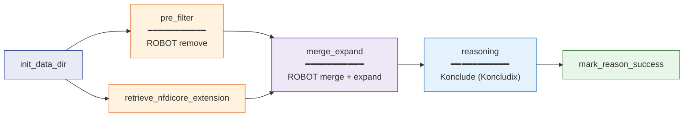

# Reasoning

**DAG ID:** `reason_koncludix`
**Schedule:** Manual trigger only
**File:** `dags/reason_koncludix.py`
**Reasoner:** [Konclude](https://github.com/konclude/Konclude), driven through the [Koncludix](https://github.com/ISE-FIZKarlsruhe/Koncludix) wrapper.

## What It Does

Performs OWL 2 DL reasoning over the MatWerk KG to materialise implicit knowledge that is only derivable from the ontological axioms defined in MWO, NFDIcore, and BFO. The reasoner computes the deductive closure of the ABox with respect to the TBox, generating inferred class assertions, subclass relationships, property assertions, and inverse-property entailments that are not explicitly stated in the input graph but are logically entailed by the ontology.

The pipeline uses [Konclude](https://github.com/konclude/Konclude), a high-performance OWL 2 reasoner that supports the $\mathcal{SROIQ}(\mathcal{D})$ description logic. Konclude is invoked through the [Koncludix](https://github.com/ISE-FIZKarlsruhe/Koncludix) Python wrapper, which drives Konclude through a small set of SPARQL extraction jobs (classes, object/datatype properties, sub-property hierarchies, class assertions) and recombines the XML results into a single inferences Turtle file.

!!! info "Why Konclude?"
    Konclude is a fast, optimisation-focused OWL 2 reasoner. The previous pipeline used Openllet and Sunlet variants; both have been retired in favour of Konclude, which is now the default reasoner for the core pipeline and all harvesters. The retired DAG scripts (`reason-spreadsheets.py`, `reason_openlletnew.py`) are kept on disk for the reproducibility of older releases but are not part of the production pipeline.

## Task Chain


```mermaid
graph LR
    A["init_data_dir"] --> B["pre_filter<br/>━━━━━━━━━━━<br/>ROBOT remove"]
    A --> R["retrieve_nfdicore_extension"]
    B --> M["merge_expand<br/>━━━━━━━━━━━<br/>ROBOT merge + expand"]
    R --> M
    M --> C["reasoning<br/>━━━━━━━━━━━<br/>Konclude (Koncludix)"]
    C --> E["mark_reason_success"]

    style A fill:#e8eaf6,stroke:#283593
    style B fill:#fff3e0,stroke:#e65100
    style R fill:#fff3e0,stroke:#e65100
    style M fill:#ede7f6,stroke:#4527a0
    style C fill:#e3f2fd,stroke:#1565c0
    style E fill:#e8f5e9,stroke:#2e7d32
```

## Step 1: Axiom Pre-Filtering

Before reasoning, the pipeline uses [ROBOT](https://robot.obolibrary.org/) to remove axioms that cause reasoning difficulties or are deprecated:

```bash
robot remove --input input.ttl \
  --term http://purl.obolibrary.org/obo/RO_0000057 \
  --axioms SubPropertyChainOf \
  remove \
  --term http://purl.obolibrary.org/obo/BFO_0000118 \
  --term http://purl.obolibrary.org/obo/BFO_0000181 \
  --term http://purl.obolibrary.org/obo/BFO_0000138 \
  --term http://purl.obolibrary.org/obo/BFO_0000136 \
  --output filtered.ttl
```

| Removed Term | Reason |
|-------------|--------|
| `RO_0000057` (SubPropertyChainOf only) | Property chain axioms on `has_participant` cause reasoning complexity explosion |
| `BFO_0000118` | Deprecated BFO class |
| `BFO_0000181` | Deprecated BFO class |
| `BFO_0000138` | Deprecated BFO class |
| `BFO_0000136` | Deprecated BFO class |

!!! warning "Why filter before reasoning?"
    SubPropertyChainOf axioms on `has_participant` (RO_0000057) interact with the large ABox to produce combinatorial explosion in reasoning time. Removing these chain axioms preserves the core semantics while making reasoning tractable. Deprecated BFO terms are removed to prevent spurious inferences from obsolete class definitions.

## Step 2: Merge with NFDIcore Extension

In parallel to the pre-filter step, the pipeline fetches the current NFDIcore extension ontology from the URL stored in the Airflow Variable `nfdicore_extension` and writes it next to the filtered input. ROBOT is then used to merge the filtered MatWerk KG with the NFDIcore extension and to expand any macro axioms:

```bash
robot merge \
  --input spreadsheets-filtered.ttl \
  --input nfdicore-extension.owl \
  expand --annotate-expansion-axioms true \
  --output spreadsheets-expanded.ttl
```

The expanded file is the input that Konclude consumes.

## Step 3: Konclude Reasoning via Koncludix

The reasoner is invoked through the Koncludix Python wrapper:

```python
from common.koncludix import koncludix

koncludix(
    binary       = "/opt/Konclude/Binaries/Konclude",
    input_file   = "spreadsheets-expanded.ttl",
    output_file  = "spreadsheets_inferences.ttl",
    work_dir     = "./koncludix",
)
```

The wrapper drives [Konclude](https://github.com/konclude/Konclude) through a small set of SPARQL extraction jobs and merges the per-job XML results into one Turtle file containing only the inferred axioms.

### Extracted Axiom Types

| Axiom Type | Description | Example |
|-----------|-------------|---------|
| **ClassAssertion** | Inferred `rdf:type` statements | A person bearing an `AgentRole` is inferred to be an `Agent` |
| **SubClassOf** | Inferred class subsumption | `ArtificialIntelligence ⊑ ComputerScience` |
| **SubPropertyOf** | Inferred property hierarchies | Specialised participation relations |
| **PropertyAssertion** | Inferred object/data property values | Inverse of `participates_in` yields `has_participant` |
| **InverseProperties** | Materialised inverse property pairs | `RO_0000056 ↔ RO_0000057` |

!!! tip "Why these axiom types?"
    This selection covers the axioms needed for SPARQL query answering: class assertions enable `?x a ?Class` patterns, property assertions enable `?x ?prop ?y` traversals, and subsumption enables hierarchical queries. Axiom types like `DisjointClasses` or `EquivalentClasses` are not extracted because they are schema-level (TBox) axioms that are already present in the input ontology.

The downstream pipeline validates that the produced file is well-formed Turtle (not accidentally RDF/XML) by inspecting the file header.

## Input

| Source | Description |
|--------|-------------|
| `matwerk_sharedfs` | Shared filesystem path |
| `matwerk_last_successful_merge_run` | Source directory (if `source_run_dir` not in conf) |
| `nfdicore_extension` | URL of the NFDIcore extension OWL file |
| `koncludebin` | Path to the Konclude executable |
| `robotcmd` | Path to the ROBOT executable |

**Conf parameters (from triggering DAG or UI):**

| Parameter | Default | Description |
|-----------|---------|-------------|
| `artifact` | `spreadsheets` | Name of the artifact being reasoned |
| `in_ttl` | `spreadsheets_asserted.ttl` | Input TTL filename |
| `source_run_dir` | (from Variable) | Custom source directory |
| `target_run_dir` | (auto-created) | Custom target directory |

## Output

| Output | Description |
|--------|------------|
| `{artifact}-filtered.ttl` | Pre-processed TTL (problematic axioms removed) |
| `{artifact}-expanded.ttl` | Merged with NFDIcore extension and ROBOT-expanded |
| `{artifact}_inferences.ttl` | Konclude reasoning output, materialised as Turtle |

**Variables set on success:**

- `matwerk_last_successful_reason_run` (if artifact is `spreadsheets`)
- `matwerk_last_successful_reason_run__{artifact}` (always)

## Downstream

None. Trigger `validation_checks` after this DAG succeeds.
